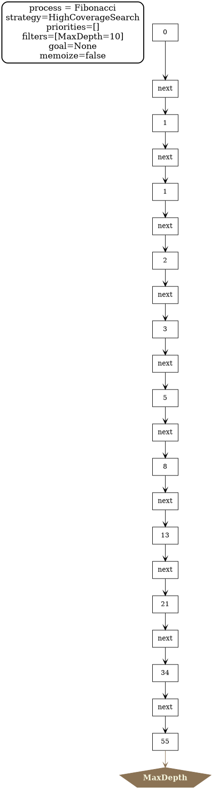

# Generic loggers for graph_process_manager_core

3 types of loggers to log processes implemented/tooled with graph_process_manager_core :
- a GraphViz logger to produce graphical representations of the processes
- a nodesPrint logger to print in files intermediate objects build during the process
- a stepsTrace logger to print traces i.e. sequences of steps taken during the process

An example use for a trivial process representing the Fibonacci sequence is given in the test module.
A maximum depth is set to 10 for this example.

Applying a simple GraphViz logger to this example process gives the following representation:

A nodesPrint logger is used here to print the numbers in the Fibonacci sequence in text files.

A stepsTrace logger is used to print the sequence of 'next' steps 
(here it is a trivial application but for other processes there may be various kinds of steps etc.).

Below is represented the files generated by the three loggers for the example toy process:

