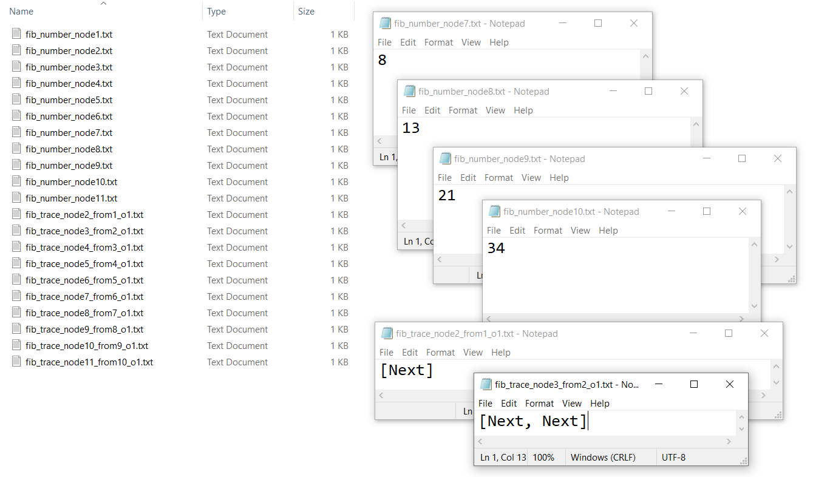
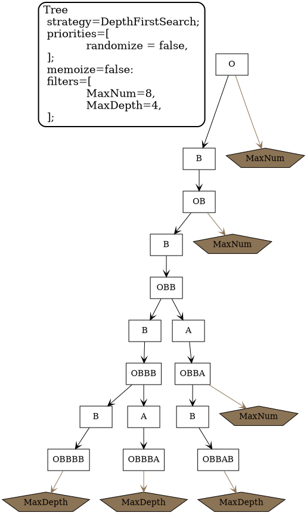
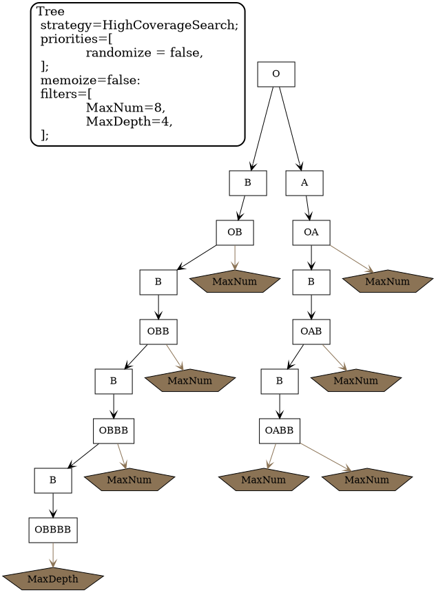
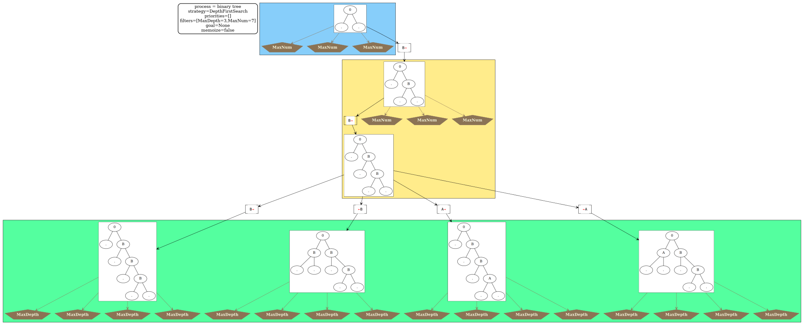

# Generic loggers for graph_process_manager_core

4 types of loggers to log processes implemented/tooled with graph_process_manager_core :
- a GraphViz logger to produce graphical representations of the processes
- a nodesPrint logger to print in files intermediate objects build during the process
- a stepsTrace logger to print in files traces i.e. sequences of steps taken during the process
- a NFAIT logger to build a Non Deterministic Finite Automaton (with Immediate Transitions)

Trivial example uses are given in the test module. We shortly describe them in the following.

## Fibonacci sequence

See "src/tests/fibo_proc/" for the implementation of the loggers' interfaces
and "src/tests/fibo_test.rs" for configuring and launching the process.

In this example, we explore the Fibonacci sequence.
A maximum depth is set to 10 for this example.

Applying a simple GraphViz logger to this example process gives the following representation:

The following Automata can be build from this exploration :

A nodesPrint logger is used here to print the numbers in the Fibonacci sequence in text files
and a stepsTrace logger is used to print the sequence of 'next' steps 
(here it is a trivial application but for other processes there may be various kinds of steps etc.).

Below is represented the files generated by the two loggers for the example toy process:

## Binary Tree

See "src/tests/tree_proc/" for the implementation of the loggers' interfaces
and "src/tests/tree_test.rs" for configuring and launching the process.

In this example we explore words built incrementally from 'O' by appending letters 'A' and 'B' to the right.
For the exploration we set a maximum depth of 4 and a maximum number of nodes (words) of 8.

Depending on the heuristic we use for the exploration, we do not reach the same set of words.

Using a BFS (Breadth First Search) we get the following:

Using a DFS (Depth First Search) we get the following:

Using a HCS (High Coverage Search, which favors branches with the least common prefixes) we get the following:

Explorations can be further specialized using more detailed filters and priorities for the selection of the next steps to take.
Randomization of the next steps to take is also possible.

## Builtin graphic logger and Tree of trees

In "src/graphviz/builtin" a builtin generic implementation of the graphic logger is proposed,
which allows to use third party drawers for each node and step.

We illustrate its use in "src/tests/tree_of_trees_proc/" and
for the implementation of this builtin logger's interface
and "src/tests/tree_of_trees_test.rs" for configuring and launching the process.

An example exploration is given below.
One can see that we use custom drawers for the nodes and steps of the process.

We also showcase here the added feature of being able to draw different phases of the process within different colored Graphviz clusters.

